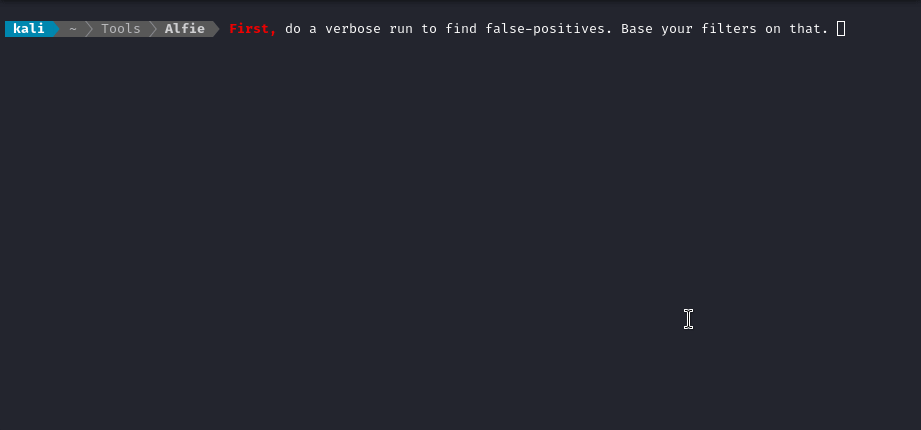
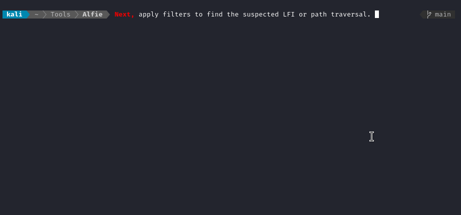

```
           ,ggg,
          dP""8I   ,dPYb, ,dPYb,                   ,,,,,,,,,,,
         dP   88   IP'`Yb IP'`Yb                  : AUTOMATIC :
        dP    88   I8  8I I8  8I   gg             : LOCAL     :
       ,8'    88   I8  8' I8  8'   ""             : FILE      :
       d88888888   I8 dP  I8 dP    gg    ,ggg,    : INCLUSION :
 __   ,8"     88   I8dP   I8dP     88   i8" "8i   : ENUMERATOR:
dP"  ,8P      Y8   I8P    I8P      88   I8, ,8I    ````````````
Yb,_,dP       `8b,,d8b,_ ,d8b,_  _,88,_ `YbadP'    by
 "Y8P"         `Y88P'"Y88PI8"88888P""Y8888P"Y888   4wayhandshake
                          I8 `8,                        🤝🤝🤝🤝
//#//#//#//#//#//#//#//#/ I8  `8, //#//#//#//#//
                          I8   8I
                          I8   8I
                          I8, ,8'
                           "Y8P'
```

Scan websites for LFI vulnerabilities and path traversals. Multi-threaded for max speed; tasteful filters for max precision.

## Usage

Good fuzzing requires separating false-positives from the actual results. **Start with Alfie by determining which filters to apply** - just like you might do with `ffuf` or `gobuster`.

In this example, a known false-positive is identified, then it's size is used as a filter:



Any combination of HTTP status codes, word counts, and response sizes can be used as filters. 

Next, **apply the filter and do a non-verbose run**. In this example, the LFI stands out right away, leading to the hidden file `package.json`:




## Options

```html
  -h, --help            
	show this help message and exit

  -v, --verbose         
	Show each requested url, along with the status code, size, and words in the response.
	Use this to help determine your filters.

  -u URL, --url URL     
	Base URI of the target. Ex. "http://mywebsite.htb/index.php?page="

  -f FUZZ_WORDLIST, --fuzz-wordlist FUZZ_WORDLIST
	Wordlist of "interesting" files to check for. 
	This wordlist should have one filename per line, with file extensions if applicable.

  -w LFI_WORDLIST, --wordlist LFI_WORDLIST
	Wordlist to use for LFI strings. 
	If not using the default, it should be similar format to lfi-list.txt.

  -t THREADS, --threads THREADS
	Number of threads to use for processing.

  --min MIN             
	Minimum number of steps "back" to traverse.

  --max MAX             
	Maximum number of steps "back" to traverse.

  --timeout TIMEOUT     
	Timeout for each request (in seconds).

  --ending ENDING       
	A character to append to the end of each test url. Ex. "%00".

  -c COOKIES, --cookies COOKIES
	Cookies to include in each request. 
	Ex '{"key1": "value1", "key2": "value2"}'.

  -d DATA, --data DATA  
	Data to include in each request. Only applies if using a POST request (see -X option).
    Ex '{"key1": "value1", "key2": "value2"}'.

  -X REQUEST_TYPE, --request-type REQUEST_TYPE
	Type of HTTP request to use. Ex "POST".

  -fs FILTER_SIZES, --filter-sizes FILTER_SIZES
	Comma-separated list of sizes (in bytes) to filter from the results.

  -fw FILTER_WORDS, --filter-words FILTER_WORDS
	Comma-separated list of word counts to filter from the results.

  -fc FILTER_CODES, --filter-codes FILTER_CODES
	Comma-separated list of HTTP status codes to filter from the results.

```


## To Do

- [x] Add a `-o` switch to output results to a file.
- [x] Include a banner with all non-default options shown
- [ ] Include a progress meter, with guesses per second and an estimated runtime.
- [ ] Improve parsing of arguments `--cookie` and `--data` so that it isn't so strict about formatting.


Please :star: this repo if you found it useful!


---

Enjoy, 

:handshake::handshake::handshake::handshake:
@4wayhandshake