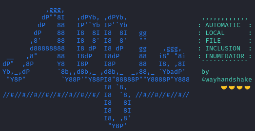
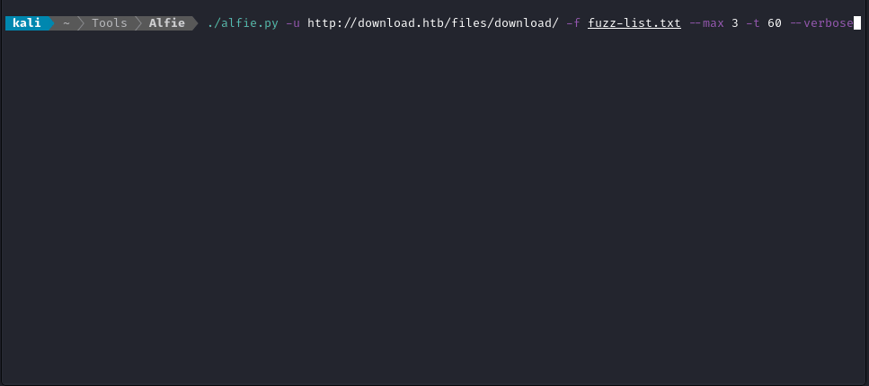
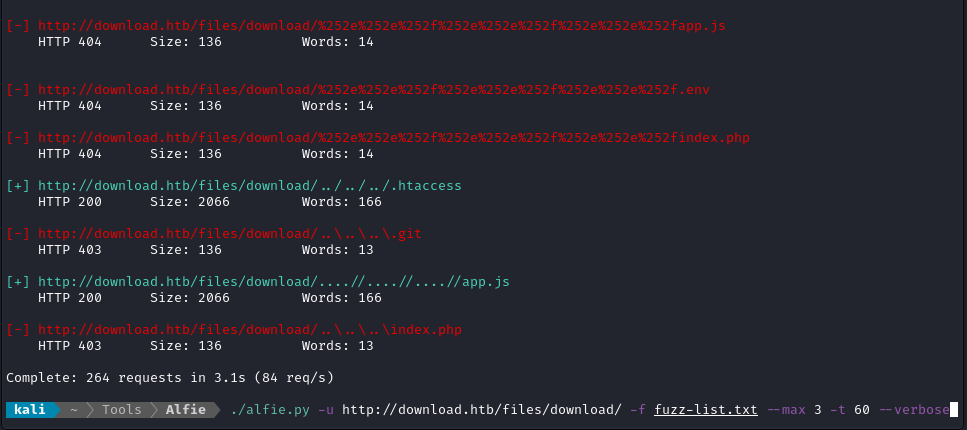

Scan websites for LFI vulnerabilities and path traversals. 

*Multi-threaded for max speed, tasteful filters for max precision.*

---

## Usage

Good fuzzing requires separating false-positives from the actual results. **Start by determining which filters to apply** - just like you might do with `ffuf` or `gobuster`. Do a **verbose** run to find some false-positives, for example:

```bash
./alfie.py -u http://download.htb/files/download/ -f fuzz-list.txt --max 3 -t 60 --verbose
```



> Any combination of HTTP **status codes**, **word counts**, and response **sizes** can be used as filters. 

Next, **apply some filters and do a non-verbose run**. In this example, the path traversal stands out right away, leading to the hidden files `package.json` and `app.js`:



For logging of your results, use the `-o` or `--output` argument. The output is a text file with one positive result per line, and can be easily read by other scripts or programs. Here is a sample:

```
http://download.htb/files/download/%2e%2e%2fpackage.json
http://download.htb/files/download/%2e%2e%2fapp.js
http://download.htb/files/download/..%2fapp.js
http://download.htb/files/download/..%2fpackage.json
```


## Options

By default, **Alfie** will output any non-default options you provide as arguments:


You can suppress this behavior and hide the banner with the `-q` or `--quiet` flag (in case you want to pipe the output to another program).

```html
  --version
	Show the version number and exit

  -h, --help            
	Show this help message and exit

  -v, --verbose         
	Show each requested url, along with the status code, size, and words in the response.
	Use this to help determine your filters.

  -u URL, --url URL     
	Base URI of the target. Ex. "http://mywebsite.htb/index.php?page="

  -f FUZZ_WORDLIST, --fuzz-wordlist FUZZ_WORDLIST
	Wordlist of "interesting" files to check for. 
	This wordlist should have one filename per line, with file extensions if applicable.

  -w LFI_WORDLIST, --wordlist LFI_WORDLIST
	Wordlist to use for LFI strings. Default lfi-list.txt.
	(If not using the default, it should be similar format to lfi-list.txt)

  -t THREADS, --threads THREADS
	Number of threads to use for processing.

  --min MIN             
	Minimum number of steps "back" to traverse. Default 1.

  --max MAX             
	Maximum number of steps "back" to traverse. Default 10.

  --timeout TIMEOUT     
	Timeout for each request (in seconds). Default 5s.

  --ending ENDING       
	A character to append to the end of each test url. Ex. "%00".

  -b COOKIES, --cookies COOKIES
	Cookies to include in each request. Ex. 'key1=value1; key2=value2'.

  -d DATA, --data DATA  
	Data to include in each request. Only applies if using a POST request (see -X option).
    Ex. 'key1=value1; key2=value2'.

  -X REQUEST_TYPE, --request-type REQUEST_TYPE
	Type of HTTP request to use. Ex "POST". Defaults to "GET".

  -fs FILTER_SIZES, --filter-sizes FILTER_SIZES
	Comma-separated list of sizes (in bytes) to filter from the results.

  -fw FILTER_WORDS, --filter-words FILTER_WORDS
	Comma-separated list of word counts to filter from the results.

  -fc FILTER_CODES, --filter-codes FILTER_CODES
	Comma-separated list of HTTP status codes to filter from the results.

  -o OUTPUT, --output OUTPUT
	File to log positive results.

  --quiet
	Don't print the banner or options.

  -nc, --no-color
	Don't ANSII colors in console output.

  -nx, --no-extra-tests
	Don't run the extra LFI tests (only useful for WAF evasion).

```


## Change Log

- 1.0.0:
  - [x] Runs successfully. Mimics behaviour of my [LFI-Enumerator bash script](https://github.com/4wayhandshake/LFI-Enumerator).
- 1.1.0:
  - [x] Add a `-o` switch to output results to a file.
  - [x] Include a banner with all non-default options shown
- 1.2.0:
  - [x] Improve parsing of arguments `--cookie` and `--data` so that it uses browser-like formatting.
- 1.3.0:
  - [x] Added "extra checks" mechanism to automate tests for things like insecure PHP modules
  - [x] Started using semantic versioning
  - [x] Updated README and `--help` to include `--no-extra-checks` and `--version`


Please :star: this repo if you found it useful!


---

Enjoy, 

:handshake::handshake::handshake::handshake:
@4wayhandshake